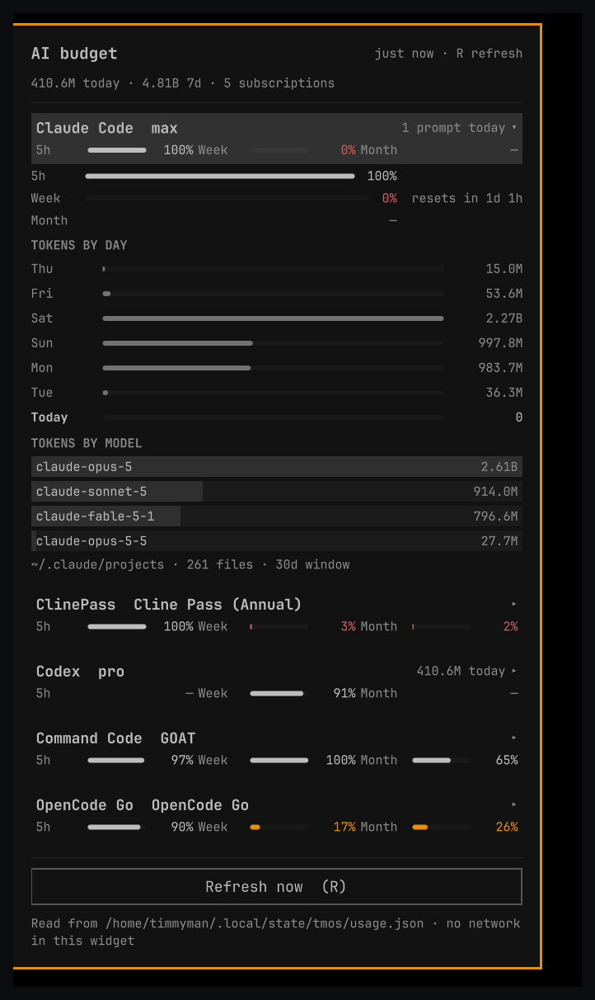

# TMOS AI Usage

Every AI subscription and API plan on your machine, in one Omarchy bar panel.

Rate-limit windows with reset times, prepaid balances, and local token history by day and by
model — for Claude Code, Codex, ClinePass, Command Code, OpenCode and anything else you have
configured. **All subscriptions are on the first page**, in the same order, so you can compare them
down the page; clicking a row opens its depth underneath without hiding the others.



## What it shows

For every provider, on the collapsed row:

- its name and plan ("Claude Code · max", "Command Code · GOAT")
- today's activity ("372.2M today", "1 prompt today")
- all three windows — **5h / week / month** — as a remaining-percent meter each, on one line
- a status badge when the number is not the provider's own (`estimate`, `sign in`, `unknown`, `error`)

Expanding a row adds, for that provider only:

- each window full width, with "resets in 1d 2h"
- the prepaid ledger, for providers that have one: remaining, spent of funded, and a draining meter
- **tokens by day** for the last seven days, scaled to the busiest day
- **tokens by model**, ranked, with the input / output / cache split on hover
- where the numbers came from — the exact transcript directory, file count and window covered

## Supported providers

Nothing is hardcoded to a subscription you do not have: a provider appears when its CLI or key is
configured, and disappears when it is not.

| Provider | Limits | Balance | Token history |
| --- | --- | --- | --- |
| Claude Code | Anthropic's own OAuth usage endpoint (5h + weekly) | — | `~/.claude/projects` transcripts |
| Codex | the ChatGPT usage endpoint, falling back to the limit reading the Codex CLI itself recorded in `~/.codex/sessions` | — | `~/.codex/sessions` rollouts |
| ClinePass | Cline's usage-limits meter, falling back to caps + charge ledger | — | — |
| Command Code | 5h + weekly meters, monthly credit pool | prepaid credit pool | — |
| OpenCode Go | OpenCode Zen usage endpoint | — | — |

## How it works

Two halves, deliberately:

| Half | What it is | What it may do |
| --- | --- | --- |
| `collector/usage_collector.py` | python3, standard library only | reads each provider's own usage endpoint with the credential that provider's CLI already stores, read-only; writes one file |
| the QML | Quickshell plugin | reads that one file. **No network, no credentials, no endpoints in the shell process.** |

Every number on screen can be traced to a line in the collector. A number the collector could not
read is absent, not guessed; a number it derived is labelled `estimate` and says how.

## Install

```sh
omarchy plugin add https://github.com/thetimmyman/tmos-ai-usage --enable
```

On install the collector starts within a few seconds and runs every five minutes after that. Its
cache is `~/.local/state/tmos-ai-usage/usage.json`; the panel reads that file and never makes a
network request of its own. `TMOS_USAGE_STATE_DIR` moves both halves if you want the state
elsewhere.

## Configure

Settings live in the widget's entry in `~/.config/omarchy/shell.json`:

```sh
omarchy bar set tmos.usage warnHeadroomPct 35    # accent below this much headroom
omarchy bar set tmos.usage lowHeadroomPct 15     # urgent below this much
omarchy bar set tmos.usage staleAfterMin 20      # call the cache stale after this long
omarchy bar set tmos.usage rotateSecs 5          # seconds per provider on the bar (0 = tightest only)
```

Move it to another bar section:

```sh
omarchy bar move tmos.usage --section right
```

## Usage

- **Bar**: one provider at a time (`Claude Code D100% W0% M—`), rotating every `rotateSecs`; the
  colour follows the least headroom.
- **Click** the bar icon to open the panel; **click a row** to expand it.
- **`j` / `k`** move through the rows, **Enter** opens the selected one, **`r`** refreshes,
  **Escape** closes, **Tab** moves to the neighbouring panel.
- **Right-click or middle-click** the bar icon to refresh immediately.
- **Keybinding**: `omarchy-shell shell summon tmos.usage '{}'` opens the panel and
  `omarchy-shell shell hide tmos.usage` closes it.

## Privacy

- Credentials are read the way the provider's own CLI stores them, read-only, and are never
  printed, logged, or written to the cache. Long token-shaped strings are scrubbed from any error
  text before it can reach the state file.
- The panel displays; it never talks to the network. Only the collector does, and only to the
  provider's own endpoint: `api.anthropic.com`, `chatgpt.com/backend-api`, `api.cline.bot`,
  `api.commandcode.ai`, `opencode.ai`.
- No telemetry, no analytics, no third-party aggregator service. Nothing leaves your machine except
  the requests to the providers you already pay.
- Reads are read-only: `~/.claude/.credentials.json`, `~/.codex/auth.json`,
  `~/.cline/data/settings/providers.json`, `~/.commandcode/auth.json`,
  `~/.local/share/opencode/auth.json`, plus the transcript directories in the table above.

## External dependencies

- `python3` (standard library only — no pip packages) for the collector.
- `quickshell` / Omarchy Quattro, which provides the plugin runtime.

## Remove

```sh
omarchy plugin remove tmos.usage
```

The collector's cache lives in `~/.local/state/`; remove that directory if you want the state gone
too.

## Roadmap

- Providers added as data, not code: a validated definition format for "one endpoint, one JSON
  path", so any provider can be supported without a release.
- Cost tracking per model, so the panel can tell you when a plan is being spent on an expensive
  model, or when a cheaper provider has headroom.
- Token history for the providers that keep their sessions in SQLite today.

## License

MIT — see `LICENSE`.
